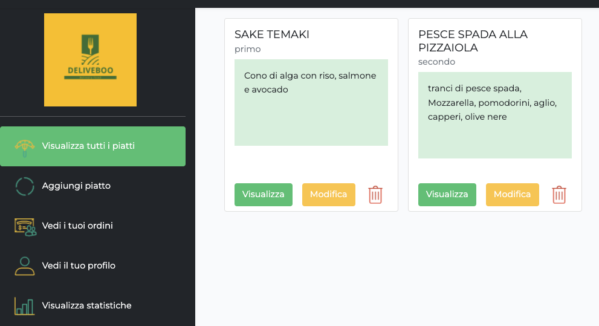
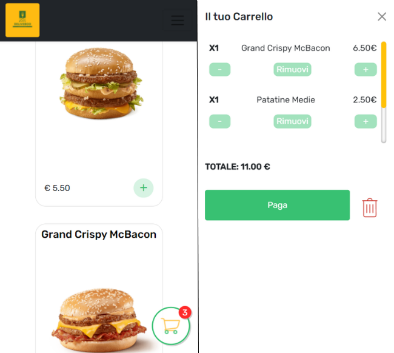

# Deliveboo

### Deliveboo is a food delivery web app that allows customers to order from their favorite restaurant (helped also by filters and searchbar) without registration, but entering only the data necessary for delivery. Restaurateurs can register in the platform and create, modify and delete dishes based also on the statistics displayed in the personal area.

<hr>

## Setup

-   Duplicate .env.example and rename it .env. <br>
-   Create database and insert info in .env

```
composer install
composer self-update
composer update
composer install

npm install

php artisan key:generate
php artisan storage:link
php artisan cache:clear
php artisan config:cache
php artisan migrate
php artisan db:seed
```

<hr>

## Compiles and hot-reloads for development, run in server

```
npm run watch
php artisan serve
```

<hr>

## Contributors

<a href="https://github.com/AndreaNocciolini">Andrea Nocciolini</a><br>
<a href="https://github.com/DavideDeLeonardis">Davide De Leonardis</a><br>
<a href="https://github.com/manu-devops98">Manuel Cappello</a><br>
<a href="https://github.com/ChriEffe">Christian Ferrazzano</a><br>
<a href="https://github.com/dariomontani">Dario Montani</a><br>

<hr>

## Screens


<br><br>

<br><br>

